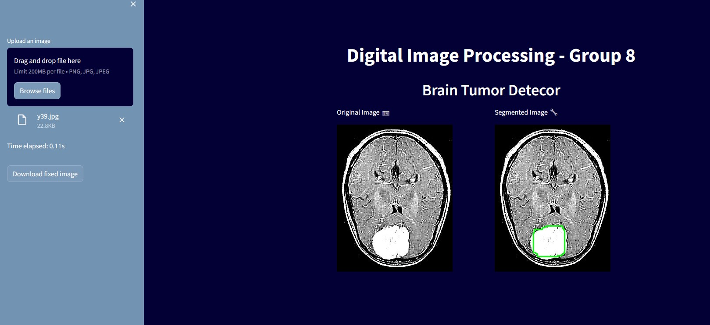
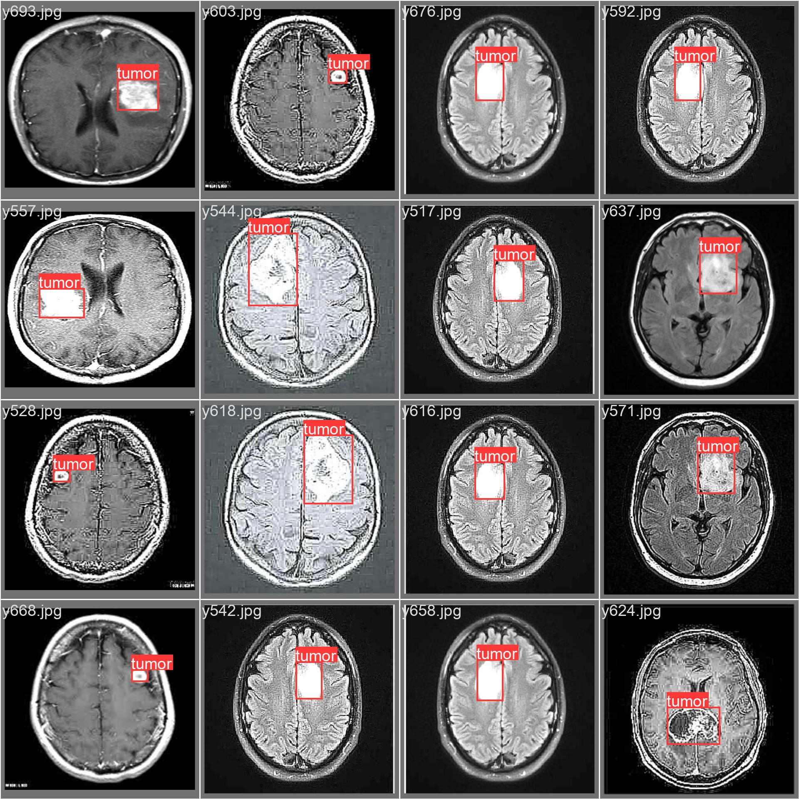

<!-- PROJECT LOGO -->
<div align="center">    
 
# Brain Tumor Detection 

<a href="https://www.python.org/"></a>
<a href="https://opencv.org/"></a>
<a href="https://streamlit.io/"></a>
 
</div>



This project adopts a dual-approach methodology to optimize the accuracy and efficiency of brain tumor detection from MRI and CT scan images. The first approach involves using the Haar Cascade algorithm, which is pivotal for rapid tumor detection through feature-based cascading classifiers. This technique will preliminarily identify potential tumor regions quickly and with reasonable accuracy. The second approach integrates Convolutional Neural Networks (CNNs) to ascertain the presence of tumors in the images. Upon positive detection, the method employs OpenCV for image segmentation to meticulously outline and segment the tumor area. This two-pronged methodology ensures a comprehensive and precise analysis, leveraging both traditional machine learning and deep learning techniques to enhance detection rates and diagnostic reliability. This structured approach facilitates a robust framework capable of handling varied imaging conditions and tumor characteristics, making the system versatile and scalable.


## Team members
------------------------------------
|Team member| Github Link|
|:---|:-----------:|
|Harvey| [:link:](https://github.com/harveyphm)|
|Haven| [:link:](https://github.com/daeullee12)|
|Damilola| [:link:](https://github.com/0001) |
|Onyi|  [:link:](https://github.com/0001) |
|Quynh|  [:link:](https://github.com/0001) |
|Felipe|  [:link:](https://github.com/0001) |
|Abolade|  [:link:](https://github.com/0001) |
|Hussain|  [:link:](https://github.com/0001) |


## Dataset
------------------------------------


The dataset used in this project is the Brain MRI Images for Brain Tumor Detection Br35H. The dataset can be downloaded from the following [link](https://www.kaggle.com/datasets/ahmedhamada0/brain-tumor-detection)

## Setup
------------------------------------

Clone the repository
```
git clone https://github.com/harveyphm/brain-tumor-detection
```
Install the required packages
```
cd brain-tumor-detection
pip install -r requirements.txt
```


## Usage
------------------------------------

To run the project, execute the following command:
```
streamlit run main.py
```

## Contributing

Contributions are what make the open source community such an amazing place to be learn, inspire, and create. Any contributions you make are **greatly appreciated**.

1. Fork the Project
2. Create your Feature Branch (`git checkout -b feature/AmazingFeature`)
3. Commit your Changes (`git commit -m 'Add some AmazingFeature'`)
4. Push to the Branch (`git push origin feature/AmazingFeature`)
5. Open a Pull Request


<!-- LICENSE -->
## License

Distributed under the MIT License. See `LICENSE` for more information.


<!-- Authors -->
## Authors

Harvey Pham 
[@Linkedin](https://www.linkedin.com/in/harveyphm/) 
Email: qhuy.phm@gmail.com


<!-- ACKNOWLEDGEMENTS -->
## Acknowledgements


## Thank you
